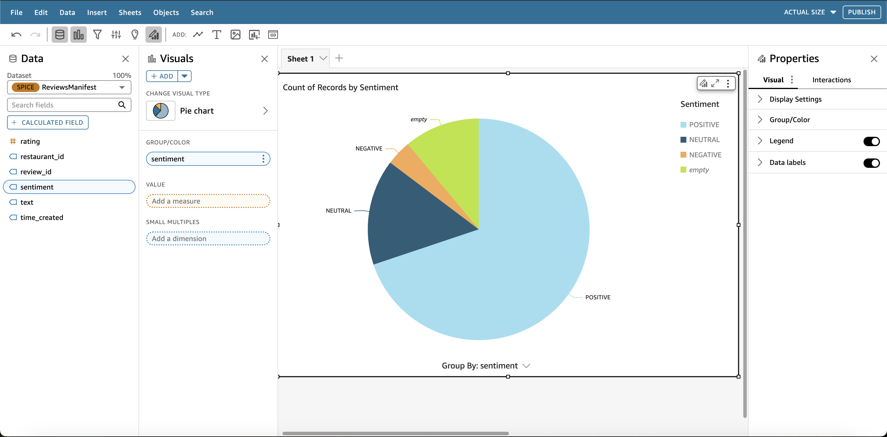
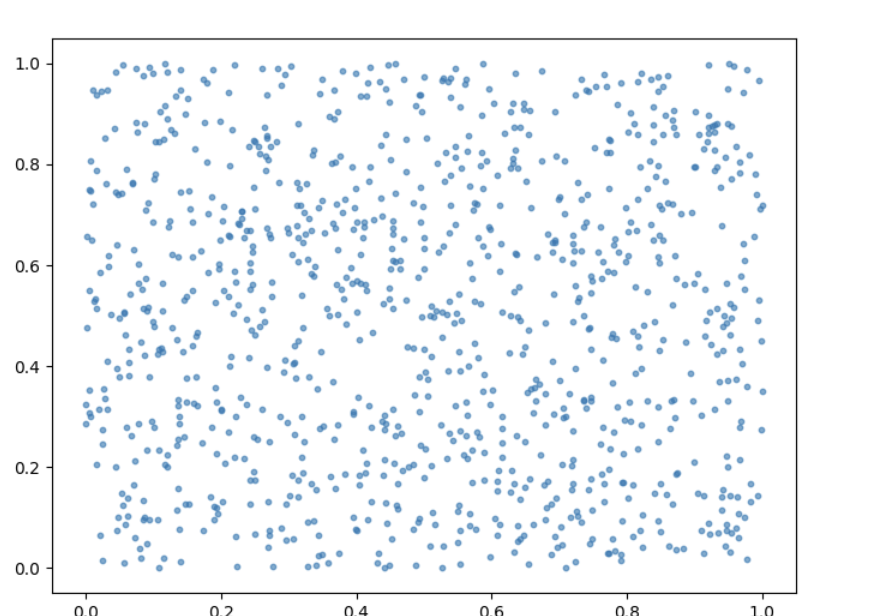
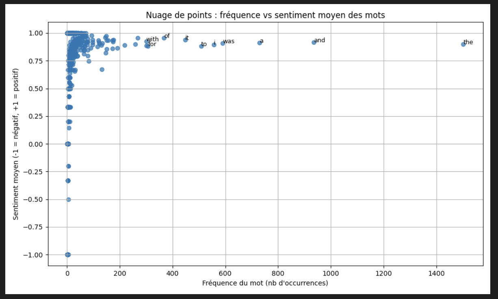
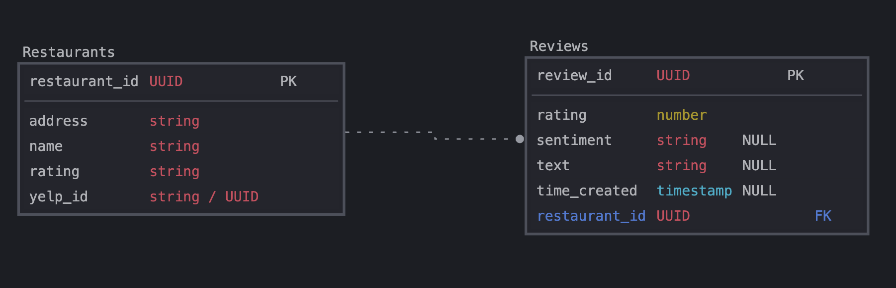

# FoodSentinelle

FoodSentinelle is a project designed to manipulate and analyze restaurant reviews based on city names, leveraging AWS services, sentiment analysis, and automation.

---

## **Table of Contents**

- [Project Overview](#project-overview)
- [Prerequisites](#prerequisites)
- [Installation](#installation)
  - [Clone the Repository](#1-clone-the-repository)
  - [Set Up Environment Variables](#2-set-up-environment-variables)
  - [Set Up Python Environment](#3-set-up-python-environment)
- [Usage](#usage)
- [API Documentation](#api-documentation)
- [Dashboard Quicksight](#dashboard-quicksight)
- [Monte Carlo Method](#monte-carlo-method)
- [Scatter Plot Analysis](#scatter-plot-analysis)
- [Database Schema](#)
- [Contributors](#contributors)

---

## **Project Overview**

This project integrates multiple technologies and services, including:

- **AWS Amplify** – For front-end hosting and backend integration.
- **Yelp Fusion API** – To fetch restaurant data and reviews.
- **DynamoDB** – For storing restaurant reviews and metadata.
- **VaderSentiment** – For sentiment analysis of customer reviews.
- **Flask** – As a lightweight API to process data.
- **Selenium** – For web scraping automation.
- **AWS Lambda** – For scheduled automation of data retrieval.
- **Amazon QuickSight** – For data visualization and analytics.
- **Amazon S3** – For storing processed data and assets.
- **AWS IAM** – For managing permissions and security.

---

## **Prerequisites**

Before you begin, ensure you have the following installed:

- **Git** – For handling repositories.
- **Python** – For setting up a virtual environment and dependencies.

---

## **Installation**

### 1. **Clone the Repository**

```bash
git clone <foodsentinelle-repository-url>
cd foodsentinelle
```

### 2. **Set Up Environment Variables**

Copy the environment variable template:

```bash
cp .env.example .env
```

Then, update the `.env` file with the required API keys and credentials.

### 3. **Set Up Python Environment**

Create and activate a virtual environment:

```bash
python3 -m venv venv
source venv/bin/activate
```

> **Note:** Ensure you see `(venv)` in your terminal before proceeding.

Install the required dependencies:

```bash
pip install -r requirements.txt
```

---

## **Usage**

To fetch restaurant reviews for a specific city, use the following command:

```bash
python -m src.main <city>
```

This will retrieve details of 10 restaurants and pick 10 random reviews.

---

## **API Documentation**

### **Available Endpoints**

#### **GET /restaurants** - Show all restaurants
```bash
curl "https://k7b3mtduz8.execute-api.eu-west-3.amazonaws.com/dev/restaurants"
```

#### **GET /restaurants/{restaurant_id}** - Show a specific restaurant
```bash
curl "https://k7b3mtduz8.execute-api.eu-west-3.amazonaws.com/dev/restaurants/T6krutcCsZ317NS_EGbUZQ"
```

#### **GET /visuals?file=nuage_points_freq_sent** - Show scatter plot
```bash
curl "https://k7b3mtduz8.execute-api.eu-west-3.amazonaws.com/dev/visuals?file=nuage_points_freq_sent_7338a016-3ef1-4c54-a582-afd1df9ef522.svg"
```

#### **GET /visuals?file=sentiment_hist** - Show sentiment diagram
```bash
curl "https://k7b3mtduz8.execute-api.eu-west-3.amazonaws.com/dev/visuals?file=sentiment_hist_3f44c0ff-669e-4c24-9b55-062d7951a5aa.svg"
```

### **Invoke Lambda Function**
To manually invoke the Lambda function using AWS CLI:

#### **Retrieve Restaurants List**
```bash
aws lambda invoke \
  --function-name FoodSentinelleAPI \
  --cli-binary-format raw-in-base64-out \
  --payload '{"path":"/restaurants","httpMethod":"GET"}' \
  restaurants.json

cat restaurants.json
```

#### **Retrieve Sentiment Histogram**
```bash
aws lambda invoke \
  --function-name FoodSentinelleAPI \
  --cli-binary-format raw-in-base64-out \
  --payload '{"path":"/visuals","httpMethod":"GET","queryStringParameters":{"file":"sentiment_hist"}}' \
  visuals_histo.json

cat visuals_histo.json
```

#### **Retrieve Scatter Plot**
```bash
aws lambda invoke \
  --function-name FoodSentinelleAPI \
  --cli-binary-format raw-in-base64-out \
  --payload '{"path":"/visuals","httpMethod":"GET","queryStringParameters":{"file":"nuage_points_freq_sent"}}' \
  visuals.json
```

#### **Example JSON Response:**
```json
{
   "statusCode": 200, 
   "body": "{\"url\": \"LINK-TO-PASTE-IN-A-NAVIGATOR\"}", 
   "headers": {
      "Content-Type": "application/json"
   }
}
```

---

## **Dashboard QuickSight**



Amazon QuickSight is integrated to provide interactive visual analytics on the collected restaurant data. The dashboard includes:

- **Sentiment Analysis Trends** – Displays positive, neutral, and negative review trends.
- **Top-Rated Restaurants** – Highlights the highest-rated places per city.
- **Customer Review Insights** – Shows common keywords and sentiment distribution.
- **Time-Based Metrics** – Tracks restaurant ratings over time.

To access the QuickSight dashboard, log in to your AWS QuickSight account and navigate to the **FoodSentinelle Dashboard**.

---

## **Monte Carlo Method**


The Monte Carlo method is used to simulate and predict sentiment trends based on restaurant reviews.

---

## **Scatter Plot Analysis**


The scatter plot visualization provides insights into word frequency and sentiment correlations within restaurant reviews.

---

## **Database Schema**



---

## **Contributors**

- **Antoine Bendafi-Schulmann**
- **Patrick Bartosik**
- **Sorën Messelier-Sentis**

